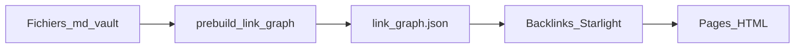
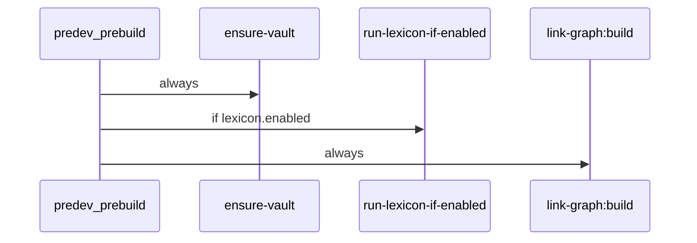

# Site-wide backlinks — phases 1 to 5 (core)

**Possible follow-up**: phases 6–7 (incremental cache and optional integrations) → [plan 2](2026_06_01_14-00_main_link-graph-backlinks-phases-6-7.plan.md).

**Prerequisites**: [Configurable multi-vault lexicon](2026_06_02_12-00_main_lexicon-config-vault.plan.md) — at minimum `config/lexicon.mjs` and `run-lexicon-if-enabled.mjs` before phases 2 and 4.

## Context

### Overview

This project separates **content** (Obsidian vault) from the **publication engine** (Astro + Starlight engine).

| Repo | Role |
|------|------|
| [`ia-on-prem-vault`](https://github.com/DamienBecherini/ia-on-prem-vault) | Markdown notes, wiki-links `[[...]]`, frontmatter, `site.config.json` |
| [`starlight-obsidian-engine`](https://github.com/DamienBecherini/starlight-obsidian-engine) | Static build, `predev`/`prebuild` scripts, publish filter, UI components |

The vault is mounted in the engine via junction (`npm run link:vault` → `src/content/docs`). Only **published** pages (not gitignored, excluding `_private/`, etc.) are included in the site — see [`config/gitignore.mjs`](../../config/gitignore.mjs) and [`config/loaders/vault-docs.mjs`](../../config/loaders/vault-docs.mjs).

**Goal**: display **backlinks** on the site — the list of published pages that **explicitly link** to the current page — for **all** site pages, with enriched presentation on lexicon entries (`tags` = `lexicon.entryTag`, e.g. `lexique` for the ZTH vault).



### Why

1. **Editorial / reading parity**: Obsidian already shows backlinks in the side panel, but the static site does not. A web reader cannot see which foundation chapters cite the term “RAM”.
2. **Book growth**: the vault will target ×10–×20 in volume. We need a **deterministic build-time** solution, testable in CI, with no per-page manual maintenance.
3. **Unchanged author convention** (ZTH vault example):
   - outside tables: `[[00-lexique/ram|RAM]]`;
   - in GFM tables: `[RAM](/00-lexique/ram/)` (the `|` breaks wiki parsing in tables).
4. **Publish filter**: unlike Obsidian, the site must never expose backlinks from or to private notes, gitignored drafts, or `_private/`.

### Why this solution (and not the others)

| Option | Verdict |
|--------|---------|
| **MD graph at prebuild + JSON + Starlight component** | **Chosen** — aligned with the opt-in lexicon pipeline (`run-lexicon-if-enabled`), reuses `gitignore`, scalable, zero MD vault injection for backlinks |
| Injecting `## Backlinks` into each `.md` | **Rejected** — Git noise, edit conflicts, does not scale |
| Obsidian cache / Backlinks panel only | **Rejected** — local IndexedDB, Obsidian absent in CI; we reuse the **same link grammar**, not the UI cache |
| remark plugin recalculated per page | **Rejected** — dev/build cost; full recalculation on every file processed |
| `starlight-site-graph` as the sole solution | **Deferred** (plan 2, phase 7) — useful global visual graph but heavier; MD graph more predictable for wiki-links before HTML render |
| Obsidian plugin export (metadata-extractor) | **Deferred** (plan 2, phase 7) — local debug; publish filter mandatory on the engine side |

### Repository scope

- **Implementation**: engine only — [`scripts/`](../../scripts/), [`src/components/`](../../src/components/), [`tests/`](../../tests/), [`config/starlight/`](../../config/starlight/).
- **Vault**: no mandatory changes for **backlinks** (no markdown injection in entries). The vault may declare a `lexicon` block in `site.config.json` (see [lexicon plan](2026_06_02_12-00_main_lexicon-config-vault.plan.md)); ZTH example: `00-lexique`, `glossaire-ia.md`.
- **Plans**: [`docs/plans/`](./) in this repo.

### Target artefact (JSON schema)

```json
{
  "generatedAt": "2026-06-01T14:00:00.000Z",
  "backlinks": {
    "00-lexique/ram": [
      { "from": "00-lexique/offloading", "title": "Offloading", "section": "00-lexique" },
      { "from": "00-lexique/vram", "title": "VRAM", "section": "00-lexique" }
    ]
  }
}
```

(ZTH vault example)

Key = vault path without extension (POSIX). Value = sorted published sources, with frontmatter title and section derived from path prefix.

---

## Phase 1 — Build-time link graph

### Objective

Build the inverted index of internal links from the published corpus.

### Tasks

1. Create [`scripts/lib/link-graph.mjs`](../../scripts/lib/link-graph.mjs):
   - recursive walk of published `.md` (same filter as [`scripts/lib/lexicon-index.mjs`](../../scripts/lib/lexicon-index.mjs) via `loadVaultGitignore`);
   - wiki extraction: regex close to `WIKI_LINK_RE` in [`scripts/lib/wiki-link-label.mjs`](../../scripts/lib/wiki-link-label.mjs);
   - internal markdown extraction: `](/path/...)` without `http` scheme;
   - target normalization: strip `#anchor`, `.md`, trailing slashes; apply `pageResolver` from [`config/markdown.mjs`](../../config/markdown.mjs) (spaces → hyphens, lowercase) for short links;
   - build inverted index `target → [{ from, title }]`.
2. CLI [`scripts/build-link-graph.mjs`](../../scripts/build-link-graph.mjs):
   - reads `VAULT_PATH` / vault root (like `generate-lexicon-index.mjs`);
   - writes [`src/generated/link-graph.json`](../../src/generated/link-graph.json).
3. Add `src/generated/` to [`.gitignore`](../../.gitignore).
4. [`package.json`](../../package.json):
   - script `link-graph:build`;
   - call in `predev` and `prebuild` **after** `run-lexicon-if-enabled` (not `lexicon:index` directly — see [lexicon plan](2026_06_02_12-00_main_lexicon-config-vault.plan.md)).

Target `predev` / `prebuild` chain:



5. Tests [`tests/link-graph.test.mjs`](../../tests/link-graph.test.mjs) with fixtures in [`tests/fixtures/minimal-vault/`](../../tests/fixtures/minimal-vault/):
   - wiki-link with alias;
   - markdown link in table;
   - link to gitignored page (absent from displayed graph);
   - self-link excluded from displayed list.

### Validation

- `npm run link-graph:build` produces valid JSON on the ZTH vault.
- Manual spot-check: compare 2–3 pages (e.g. `00-lexique/ram` on ZTH vault, one foundation) with the Obsidian Backlinks panel for **explicit links** only.

---

## Phase 2 — Resolution and publish filter

### Objective

Align target resolution with Obsidian/Starlight and ensure no unpublished page appears.

### Tasks

1. Extend the title index ([`buildVaultTitleIndex`](../../scripts/lib/wiki-link-label.mjs)) to include frontmatter **aliases** → canonical slug.
2. Keep only **published source → published target** edges (unpublished sources are never scanned).
3. Exclude from **displayed lists** (via [`loadLexiconConfig`](../../config/lexicon.mjs)):
   - if `lexicon.enabled`: `{directory}/{hubSlug}` and `{directory}/{indexSlug}` (slugs derived from `hubPage` / `indexPage` without `.md`);
   - if lexicon disabled: no lexicon-specific exclusions;
   - self-references (source === target) — always.

   ZTH example (illustration only): `00-lexique/glossaire-ia`, `00-lexique/index-lexique`.
4. Links to non-existent target: silently ignore in prod; optional `--verbose` log in dev.

### Validation

- No backlinks from/to `_private/` or files covered by `.gitignore`.
- Resolved alias: if a note has `aliases: [RAM]` and an article links `[[RAM]]`, the backlink appears on the canonical entry (e.g. `00-lexique/ram` on ZTH vault).

---

## Phase 3 — Display on all pages

### Objective

Show backlinks on **every** published site page (not only the lexicon).

### Tasks

1. Component [`src/components/PageBacklinks.astro`](../../src/components/PageBacklinks.astro):
   - imports `link-graph.json`;
   - derives current slug from URL / Starlight route;
   - renders a list of links `[title](/from/)`;
   - **renders nothing** if the list is empty.
2. Register in [`config/starlight/index.mjs`](../../config/starlight/index.mjs):
   - override `PageSidebar` (or equivalent Starlight 0.39 component) to include `PageBacklinks`;
   - default **doc** variant: title “Incoming references”.
3. Verify locale compatibility (`en/`, etc.): JSON keys = relative vault paths, URLs = Starlight site paths.

### Validation

- A `01-fondations/...` page cited elsewhere shows its backlinks.
- Page with no incoming reference: no empty block.

---

## Phase 4 — Lexicon UX

### Objective

Differentiate presentation on term/acronym entries.

### Tasks

1. **Lexicon** variant detection:
   - `lexicon.enabled` and `tags` contains `lexicon.entryTag` (ZTH vault default: `lexique`);
   - exclude configured hubs (same slugs as phase 2).
2. **Lexicon** variant:
   - title “Pages that mention this term”;
   - grouping by first path segment (`01-fondations`, `{lexicon.directory}`, `02-...`, etc.);
   - stable order (FR alpha within each group).
3. Styles [`src/styles/backlinks-starlight.css`](../../src/styles/backlinks-starlight.css) + Starlight `customCss` entry.

### Validation

- ZTH vault entry `00-lexique/ram.md`: lists pages that explicitly link to RAM (e.g. offloading, vram), grouped by section.

---

## Phase 5 — Engine documentation

### Objective

Document the feature for engine maintainers and vault authors.

### Tasks

1. Engine README section ([`README.md`](../../README.md)):
   - command `npm run link-graph:build`;
   - artefact `src/generated/link-graph.json` (gitignored, regenerated at build);
   - publish rules and hub exclusions (via `lexicon` block — see [lexicon plan](2026_06_02_12-00_main_lexicon-config-vault.plan.md));
   - doc vs lexicon UI variants;
   - do not document `glossaire-ia` as a global engine convention;
   - link to this plan.
2. Author note (in README, not in the vault): only **explicit links** count; textual mentions without wiki/MD links do not generate backlinks.

### Validation

- README up to date; `npm test` passes (link-graph tests included).

---

## End of plan 1

After phases 1–5, the feature is **usable in static production** with no Obsidian dependency and no vault modification.

**Next**: scale optimizations and optional integrations → [2026_06_01_14-00_main_link-graph-backlinks-phases-6-7.plan.md](2026_06_01_14-00_main_link-graph-backlinks-phases-6-7.plan.md).

---

## Risks and mitigations

| Risk | Mitigation |
|--------|------------|
| Ambiguous short links `[[ram]]` vs full path | Prefer explicit paths in the vault; alias resolution in phase 2 |
| remark-wiki-link vs extractor divergence | Fixture tests + same `pageResolver` as `config/markdown.mjs` |
| Missing `link-graph.json` in dev (first clone) | `predev` regenerates; component tolerates missing file (absent section) |
| Future performance | plan 2 phase 6 (incremental cache) |

---

## Implementation report

**Date**: 2026-06-02  
**Status**: delivered (phases 1–5)

### Changes

| Phase | Files |
|-------|----------|
| 1 | [`scripts/lib/link-graph.mjs`](../../scripts/lib/link-graph.mjs), [`scripts/build-link-graph.mjs`](../../scripts/build-link-graph.mjs), [`scripts/lib/link-graph-data.mjs`](../../scripts/lib/link-graph-data.mjs), [`tests/link-graph.test.mjs`](../../tests/link-graph.test.mjs), [`tests/fixtures/link-graph-vault/`](../../tests/fixtures/link-graph-vault/), `.gitignore` → `src/generated/` |
| 2 | Alias/title resolution, publish filter, `getLexiconDisplayExclusions` via [`config/lexicon.mjs`](../../config/lexicon.mjs) |
| 3–4 | [`src/components/PageBacklinks.astro`](../../src/components/PageBacklinks.astro), [`src/components/PageSidebar.astro`](../../src/components/PageSidebar.astro), [`src/lib/backlinks-routing.mjs`](../../src/lib/backlinks-routing.mjs), [`src/styles/backlinks-starlight.css`](../../src/styles/backlinks-starlight.css) |
| 5 | [`config/starlight/index.mjs`](../../config/starlight/index.mjs) (`PageSidebar` + CSS), [`README.md`](../../README.md), [`package.json`](../../package.json) hooks (`predev`/`prebuild` after lexicon) |

### Fix

- `normalizeLinkTarget`: strip anchor **before** `.md` extension (e.g. `/page-b.md#x` → `page-b`).

### Validation

- `npm test`: **68** tests, 0 failures.
- ZTH vault (`ia-on-prem-vault`): `link-graph:build` → **31** targets, **139** backlinks → `src/generated/link-graph.json`.
- `prebuild`: lexicon index **26** entries + graph regenerated.
- `npm run build`: **68** HTML pages (FR + EN), build OK.
- Junction `src/content/docs` recreated toward ZTH vault (shell still had `FORCE_VAULT_PATH=1` + minimal fixture from a previous test).

### Next

Phases 6–7 (incremental cache, optional integrations): [plan 2](2026_06_01_14-00_main_link-graph-backlinks-phases-6-7.plan.md).
