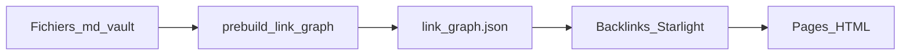
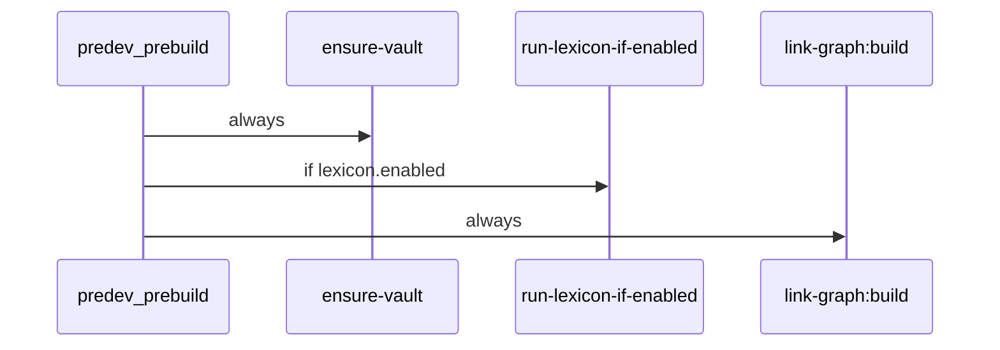

# Rétroliens site-wide — phases 1 à 5 (cœur)

**Suite possible** : phases 6–7 (cache incrémental et intégrations optionnelles) → [plan 2](2026_06_01_14-00_main_link-graph-backlinks-phases-6-7.plan.md).

**Prérequis** : [Lexique configurable multi-vault](2026_06_02_12-00_main_lexicon-config-vault.plan.md) — au minimum `config/lexicon.mjs` et `run-lexicon-if-enabled.mjs` avant les phases 2 et 4.

## Contexte

### Vue d'ensemble

Ce projet sépare le **contenu** (vault Obsidian) du **moteur de publication** (engine Astro + Starlight).

| Repo | Rôle |
|------|------|
| [`ia-on-prem-vault`](https://github.com/DamienBecherini/ia-on-prem-vault) | Notes Markdown, wiki-links `[[...]]`, frontmatter, `site.config.json` |
| [`starlight-obsidian-engine`](https://github.com/DamienBecherini/starlight-obsidian-engine) | Build statique, scripts `predev`/`prebuild`, filtre publish, composants UI |

Le vault est monté dans l'engine via junction (`npm run link:vault` → `src/content/docs`). Seules les pages **publiées** (non gitignorées, hors `_private/`, etc.) entrent dans le site — voir [`config/gitignore.mjs`](../../config/gitignore.mjs) et [`config/loaders/vault-docs.mjs`](../../config/loaders/vault-docs.mjs).

**Objectif** : afficher sur le site les **rétroliens** — la liste des pages publiées qui **lien explicitement** vers la page courante — pour **toutes** les pages du site, avec une présentation enrichie sur les fiches lexique (`tags` = `lexicon.entryTag`, ex. `lexique` pour le vault ZTH).



### Pourquoi

1. **Parité éditoriale / lecture** : Obsidian affiche déjà des rétroliens dans le panneau latéral, mais le site statique ne les montre pas. Un lecteur web ne voit pas quelles fondations citent le terme « RAM ».
2. **Croissance du livre** : le vault visera ×10–×20 en volume. Il faut une solution **déterministe au build**, testable en CI, sans maintenance manuelle par fiche.
3. **Convention auteur inchangée** (exemple vault ZTH) :
   - hors tableaux : `[[00-lexique/ram|RAM]]` ;
   - dans les tableaux GFM : `[RAM](/00-lexique/ram/)` (le `|` casse le parsing wiki en tableau).
4. **Filtre publish** : contrairement à Obsidian, le site ne doit jamais exposer de rétroliens depuis ou vers des notes privées, brouillons gitignorés ou `_private/`.

### Pourquoi cette solution (et pas les autres)

| Option | Verdict |
|--------|---------|
| **Graphe MD au prebuild + JSON + composant Starlight** | **Retenu** — aligné sur le pipeline lexicon opt-in (`run-lexicon-if-enabled`), réutilise `gitignore`, scalable, zéro injection MD vault pour les backlinks |
| Injection `## Rétroliens` dans chaque `.md` | **Rejeté** — bruit Git, conflits édition, ne scale pas |
| Cache / panneau Rétroliens Obsidian seul | **Rejeté** — IndexedDB local, Obsidian absent en CI ; on réutilise la **même grammaire de liens**, pas le cache UI |
| Plugin remark recalculé par page | **Rejeté** — coût dev/build ; recalcul global à chaque fichier traité |
| `starlight-site-graph` comme solution unique | **Reporté** (plan 2, phase 7) — graphe visuel global utile mais plus lourd ; graphe MD plus prévisible pour wiki-links avant rendu HTML |
| Export plugin Obsidian (metadata-extractor) | **Reporté** (plan 2, phase 7) — debug local ; filtre publish obligatoire côté engine |

### Périmètre repo

- **Implémentation** : engine uniquement — [`scripts/`](../../scripts/), [`src/components/`](../../src/components/), [`tests/`](../../tests/), [`config/starlight/`](../../config/starlight/).
- **Vault** : aucun changement obligatoire pour les **backlinks** (pas d'injection markdown dans les fiches). Le vault peut déclarer un bloc `lexicon` dans `site.config.json` (voir [plan lexicon](2026_06_02_12-00_main_lexicon-config-vault.plan.md)) ; exemple ZTH : `00-lexique`, `glossaire-ia.md`.
- **Plans** : [`docs/plans/`](./) dans ce repo.

### Artefact cible (schéma JSON)

```json
{
  "generatedAt": "2026-06-01T14:00:00.000Z",
  "backlinks": {
    "00-lexique/ram": [
      { "from": "00-lexique/offloading", "title": "Offloading", "section": "00-lexique" },
      { "from": "00-lexique/vram", "title": "VRAM", "section": "00-lexique" }
    ]
  }
}
```

(exemple vault ZTH)

Clé = chemin vault sans extension (POSIX). Valeur = sources publiées triées, avec titre frontmatter et section dérivée du préfixe de chemin.

---

## Phase 1 — Graphe de liens au build

### Objectif

Construire l'index inversé des liens internes à partir du corpus publié.

### Tâches

1. Créer [`scripts/lib/link-graph.mjs`](../../scripts/lib/link-graph.mjs) :
   - walk récursif des `.md` publiés (même filtre que [`scripts/lib/lexicon-index.mjs`](../../scripts/lib/lexicon-index.mjs) via `loadVaultGitignore`) ;
   - extraction wiki : regex proche de `WIKI_LINK_RE` dans [`scripts/lib/wiki-link-label.mjs`](../../scripts/lib/wiki-link-label.mjs) ;
   - extraction markdown interne : `](/chemin/...)` sans schéma `http` ;
   - normalisation cibles : retirer `#ancre`, `.md`, slashes de bord ; appliquer `pageResolver` de [`config/markdown.mjs`](../../config/markdown.mjs) (espaces → tirets, minuscules) pour liens courts ;
   - construction index inversé `target → [{ from, title }]`.
2. CLI [`scripts/build-link-graph.mjs`](../../scripts/build-link-graph.mjs) :
   - lit `VAULT_PATH` / vault root (comme `generate-lexicon-index.mjs`) ;
   - écrit [`src/generated/link-graph.json`](../../src/generated/link-graph.json).
3. Ajouter `src/generated/` au [`.gitignore`](../../.gitignore).
4. [`package.json`](../../package.json) :
   - script `link-graph:build` ;
   - appel dans `predev` et `prebuild` **après** `run-lexicon-if-enabled` (pas `lexicon:index` direct — voir [plan lexicon](2026_06_02_12-00_main_lexicon-config-vault.plan.md)).

Chaîne cible `predev` / `prebuild` :



5. Tests [`tests/link-graph.test.mjs`](../../tests/link-graph.test.mjs) avec fixtures dans [`tests/fixtures/minimal-vault/`](../../tests/fixtures/minimal-vault/) :
   - wiki-link avec alias ;
   - lien MD tableau ;
   - lien vers page gitignorée (absent du graphe affiché) ;
   - auto-lien exclu de la liste affichée.

### Validation

- `npm run link-graph:build` produit un JSON valide sur le vault ZTH.
- Spot-check manuel : comparer 2–3 pages (ex. `00-lexique/ram` sur vault ZTH, une fondation) avec le panneau Rétroliens Obsidian pour les **liens explicites** uniquement.

---

## Phase 2 — Résolution et filtre publish

### Objectif

Aligner la résolution des cibles sur Obsidian/Starlight et garantir qu'aucune page non publiée n'apparaît.

### Tâches

1. Étendre l'index titres ([`buildVaultTitleIndex`](../../scripts/lib/wiki-link-label.mjs)) pour inclure **aliases** frontmatter → slug canonique.
2. Ne conserver que les arêtes **source publiée → cible publiée** (les sources non publiées ne sont jamais scannées).
3. Exclure des **listes affichées** (via [`loadLexiconConfig`](../../config/lexicon.mjs)) :
   - si `lexicon.enabled` : `{directory}/{hubSlug}` et `{directory}/{indexSlug}` (slugs dérivés de `hubPage` / `indexPage` sans `.md`) ;
   - si lexicon désactivé : pas d'exclusions spécifiques lexique ;
   - auto-références (source === cible) — toujours.

   Exemple ZTH (illustration uniquement) : `00-lexique/glossaire-ia`, `00-lexique/index-lexique`.
4. Liens vers cible inexistante : ignorer silencieusement en prod ; option log `--verbose` en dev.

### Validation

- Aucun rétrolien depuis/vers `_private/` ou fichier couvert par `.gitignore`.
- Alias résolu : si une note a `aliases: [RAM]` et qu'un article lie `[[RAM]]`, le rétrolien apparaît sur la fiche canonique (ex. `00-lexique/ram` sur vault ZTH).

---

## Phase 3 — Affichage toutes pages

### Objectif

Montrer les rétroliens sur **chaque** page publiée du site (pas seulement le lexique).

### Tâches

1. Composant [`src/components/PageBacklinks.astro`](../../src/components/PageBacklinks.astro) :
   - importe `link-graph.json` ;
   - dérive le slug courant depuis l'URL / route Starlight ;
   - rend une liste de liens `[title](/from/)` ;
   - **ne rend rien** si la liste est vide.
2. Enregistrer dans [`config/starlight/index.mjs`](../../config/starlight/index.mjs) :
   - surcharge `PageSidebar` (ou composant équivalent Starlight 0.39) pour inclure `PageBacklinks` ;
   - variante **doc** par défaut : titre « Références entrantes ».
3. Vérifier compatibilité locales (`en/` etc.) : clés JSON = chemins vault relatifs, URLs = chemins site Starlight.

### Validation

- Page `01-fondations/...` citée ailleurs affiche ses rétroliens.
- Page sans référence entrante : pas de bloc vide.

---

## Phase 4 — UX lexique

### Objectif

Différencier la présentation sur les fiches terme/acronyme.

### Tâches

1. Détection variante **lexicon** :
   - `lexicon.enabled` et `tags` contient `lexicon.entryTag` (défaut vault ZTH : `lexique`) ;
   - exclure les hubs configurés (mêmes slugs que phase 2).
2. Variante **lexicon** :
   - titre « Pages qui mentionnent ce terme » ;
   - regroupement par premier segment de chemin (`01-fondations`, `{lexicon.directory}`, `02-...`, etc.) ;
   - ordre stable (alpha FR dans chaque groupe).
3. Styles [`src/styles/backlinks-starlight.css`](../../src/styles/backlinks-starlight.css) + entrée `customCss` Starlight.

### Validation

- Fiche vault ZTH `00-lexique/ram.md` : liste les pages qui lient explicitement vers RAM (ex. offloading, vram), groupées par section.

---

## Phase 5 — Documentation engine

### Objectif

Documenter la feature pour les mainteneurs engine et les auteurs vault.

### Tâches

1. Section README engine ([`README.md`](../../README.md)) :
   - commande `npm run link-graph:build` ;
   - artefact `src/generated/link-graph.json` (gitignoré, regénéré au build) ;
   - règles publish et exclusions hubs (via bloc `lexicon` — voir [plan lexicon](2026_06_02_12-00_main_lexicon-config-vault.plan.md)) ;
   - variantes UI doc vs lexicon ;
   - ne pas documenter `glossaire-ia` comme convention engine globale ;
   - lien vers ce plan.
2. Note auteurs (dans README, pas dans le vault) : seuls les **liens explicites** comptent ; mentions textuelles sans lien wiki/MD ne génèrent pas de rétrolien.

### Validation

- README à jour ; `npm test` passe (tests link-graph inclus).

---

## Fin du plan 1

À l'issue des phases 1–5, la feature est **utilisable en production statique** sans dépendance Obsidian ni modification du vault.

**Suite** : optimisations d'échelle et intégrations optionnelles → [2026_06_01_14-00_main_link-graph-backlinks-phases-6-7.plan.md](2026_06_01_14-00_main_link-graph-backlinks-phases-6-7.plan.md).

---

## Risques et mitigations

| Risque | Mitigation |
|--------|------------|
| Liens courts ambigus `[[ram]]` vs chemin complet | Préférer chemins explicites dans le vault ; résolution alias en phase 2 |
| Divergence remark-wiki-link vs extracteur | Tests fixtures + même `pageResolver` que `config/markdown.mjs` |
| `link-graph.json` absent en dev (premier clone) | `predev` regénère ; composant tolère fichier manquant (section absente) |
| Performance future | plan 2 phase 6 (cache incrémental) |
