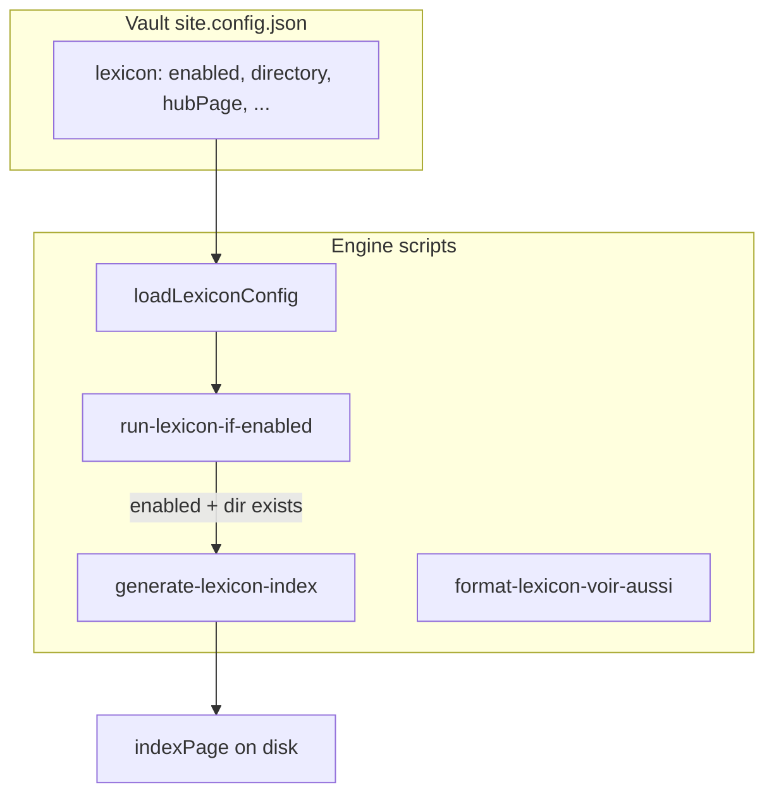

# Configurable multi-vault lexicon

**Prerequisite for**: [Backlinks phases 1–5](2026_06_01_14-00_main_link-graph-backlinks-phases-1-5.plan.md) — deliver this plan **before** phases 2 and 4 of the backlinks plan (hub exclusions and `entryTag`).

**Consumed by**: backlinks plan (phases 2, 4, prebuild hooks).

## Objective

The engine stays **generic**: logic (scan, index, “See also” formatting) lives in [starlight-obsidian-engine](https://github.com/DamienBecherini/starlight-obsidian-engine). Each vault declares **whether** and **how** it uses the lexicon via `site.config.json` (e.g. [`ia-on-prem-vault`](https://github.com/DamienBecherini/ia-on-prem-vault)). The engine README documents the mechanism; the ZTH vault documents the concrete instance (`00-lexique`, `glossaire-ia`).



## Global execution order

1. Lexicon plan (this document) — `config/lexicon.mjs` + predev gate
2. Backlinks plan phase 1 — link-graph lib (may overlap the end of the lexicon plan)
3. Backlinks plan phases 2–5 — uses `loadLexiconConfig()`

## Current state (to fix)

- Hardcoded constants in [`scripts/lib/lexicon-index.mjs`](../../scripts/lib/lexicon-index.mjs): `00-lexique`, `glossaire-ia.md`, `index-lexique.md`, tag `lexique`, hardcoded FR strings.
- [`package.json`](../../package.json): `predev` / `prebuild` always call `generate-lexicon-index.mjs` → **failure** if there is no lexicon directory ([`collectLexiconEntries`](../../scripts/lib/lexicon-index.mjs) throws).
- [`config/site.mjs`](../../config/site.mjs): does not read a `lexicon` key (only title, url, locales, sidebar, social).
- Engine README: section coupled to `glossaire-ia` / `index-lexique` (lines 87–93).

## `site.config.json` contract

Add an optional `lexicon` block (documented in the engine README):

| Field | Role | Default when `enabled: true` |
|-------|------|---------------------------|
| `enabled` | Enables scan + generation | `false` if block absent |
| `directory` | Vault folder for entries | **required** when enabled |
| `entryTag` | Frontmatter tag for entries | `lexique` |
| `hubPage` | Curated hub file (excluded from scan) | **required** when enabled |
| `indexPage` | Generated index file | **required** when enabled |
| `sortLocale` | Title sort (`localeCompare`) | `fr` |
| `index.title` | Index frontmatter title | required |
| `index.description` | Index frontmatter description | required |
| `index.intro` | Paragraph below frontmatter (free markdown) | required |
| `index.hubLink` | `{ "path": "glossaire-ia", "label": "Glossaire IA" }` — wiki path **without** extension, relative to vault (engine prefixes `directory/` for `[[...]]` link if needed) | optional |

**Behavior rules**

- Block absent or `enabled: false` → skip (exit 0, info log) for build/dev hook.
- `enabled: true` + missing directory → skip with warning (do not block `npm run dev` on a vault without a physical lexicon).
- `npm run lexicon:index` (explicit) → clear error if config invalid or directory missing (strict behavior).
- No silent fallback to ZTH names (`glossaire-ia`) in the engine: explicit migration in the ZTH vault.

**ZTH example** (to add in [`ia-on-prem-vault`](https://github.com/DamienBecherini/ia-on-prem-vault) `site.config.json`) — equivalent to current constants:

```jsonc
"lexicon": {
  "enabled": true,
  "directory": "00-lexique",
  "entryTag": "lexique",
  "hubPage": "glossaire-ia.md",
  "indexPage": "index-lexique.md",
  "sortLocale": "fr",
  "index": {
    "title": "Index du lexique",
    "description": "Liste alphabétique de toutes les fiches du lexique IA on-premise.",
    "intro": "Liste générée automatiquement au build. Pour une lecture guidée, voir [[00-lexique/glossaire-ia|Glossaire IA]].",
    "hubLink": { "path": "glossaire-ia", "label": "Glossaire IA" }
  }
}
```

The “Glossaire IA” / “Index du lexique” sidebar **stays unchanged** in `site.config.json` (already vault-owned) — no automatic sidebar generation by the engine.

## Engine implementation

### 1. Config module — `config/lexicon.mjs` (new)

- `loadLexiconConfig(vaultRoot?)`: reads `site.config.json` via `resolveVaultPath()` (same pattern as [`config/site.mjs`](../../config/site.mjs)).
- `isLexiconEnabled(config)` / `resolveLexiconPaths(config, vaultRoot)`: absolute paths for directory, hub, index.
- Minimal validation: if `enabled`, required fields present; actionable error messages.
- Export a JSDoc typedef `LexiconConfig` for scripts.

Do not extend `loadSiteConfig()` return for Starlight (avoids mixing Astro config and CLI tooling).

### 2. Refactor [`scripts/lib/lexicon-index.mjs`](../../scripts/lib/lexicon-index.mjs)

- Replace global constant exports with a **`LexiconConfig`** object passed as argument:
  - `collectLexiconEntries(vaultRoot, config)`
  - `renderIndexMarkdown(entries, config)` — links `/{directory}/{slug}/`, intro/title/description from `config.index`
  - `buildLexiconIndex` / `writeLexiconIndex(vaultRoot, config)`
- Keep `parseLexiconFrontmatter`, `escapeTableCell`, `readLexiconEntry` (generic).
- Remove hardcoded references to `00-lexique` / `glossaire-ia` in generated markdown.

### 3. CLI scripts

| File | Change |
|---------|------------|
| [`scripts/generate-lexicon-index.mjs`](../../scripts/generate-lexicon-index.mjs) | Load config; if disabled → message + exit 0; if enabled → `writeLexiconIndex` |
| [`scripts/format-lexicon-voir-aussi.mjs`](../../scripts/format-lexicon-voir-aussi.mjs) | Same gate; directory / skip pages → from config |
| **`scripts/run-lexicon-if-enabled.mjs`** (new) | Called by `predev` / `prebuild`: enabled + dir OK → spawn index; otherwise log and exit 0 |

[`package.json`](../../package.json):

```json
"predev": "node scripts/ensure-vault.mjs && node scripts/run-lexicon-if-enabled.mjs",
"prebuild": "node scripts/ensure-vault.mjs && node scripts/run-lexicon-if-enabled.mjs"
```

[`scripts/lib/wiki-link-label.mjs`](../../scripts/lib/wiki-link-label.mjs): unchanged (walks entire vault; `readLexiconEntry` remains valid).

### 4. Tests — [`tests/lexicon-index.test.mjs`](../../tests/lexicon-index.test.mjs)

- Add `tests/lexicon-config.test.mjs`: disabled by default, enabled validation, resolved paths.
- Adapt existing tests: pass a mock config object (directory `00-lexique` or custom `glossary`).
- [`tests/fixtures/minimal-vault/site.config.json`](../../tests/fixtures/minimal-vault/site.config.json): no `lexicon` block (or `"enabled": false`) — ensures `npm run dev` does not break.
- Optional: mini fixture `tests/fixtures/lexicon-vault/` (2 entries + config) for integration test `writeLexiconIndex` with `directory: "glossary"`.

Verify `npm test` and [`npm run test:build`](../../tests/smoke-build.mjs) pass (smoke build does not use `prebuild` — already OK).

### 5. Documentation

**Engine — [`README.md`](../../README.md)**

- Replace “Lexicon index (`index-lexique.md`)” section with **“Optional lexicon (vault `site.config.json`)”**:
  - `lexicon` block schema;
  - entry convention (`title`, `description`, `entryTag`);
  - hub vs generated index;
  - `lexicon:index` / `lexicon:voir-aussi` commands;
  - generic example (`glossary/`, not `glossaire-ia`).
- Scripts table: clarify that `predev`/`prebuild` run index only if `lexicon.enabled`.

**ZTH vault — README of [`ia-on-prem-vault`](https://github.com/DamienBecherini/ia-on-prem-vault) repo**

- Add `00-lexique/` to “Vault layout”.
- Short “Lexicon” section: hub `glossaire-ia.md`, generated index, template `_templates/_Terme Lexique.md`, `npm run lexicon:index` command from engine, `index-lexique.md` commit policy (keep current: commit with vault when entries change).

**Optional vault**: `npm run lexicon:index` via vault `scripts/delegate.mjs` — out of minimal scope; mention in vault doc without implementing unless requested.

### 6. ZTH vault — content migration

- Add `lexicon` block in ZTH vault `site.config.json`.
- Run once `npm run lexicon:index` (engine) to regenerate `00-lexique/index-lexique.md` with new intro (should stay equivalent if config correct).
- No mandatory changes to lexicon entries or `glossaire-ia.md` (wiki paths unchanged).

### 7. Out of scope (note only)

- Git duplicates `00-lexique/foo.md` vs `00-lexique\foo.md` on Windows: manual cleanup separately in vault.
- Plan publication in `AIContextCraft/docs/plans/`: not applicable (engine/vault workspace).

## Recommended execution order (this plan)

1. `config/lexicon.mjs` + config tests
2. Refactor `lexicon-index.mjs` + update lexicon tests
3. `run-lexicon-if-enabled.mjs` + `package.json` hooks
4. Adapt `generate-lexicon-index.mjs` / `format-lexicon-voir-aussi.mjs`
5. ZTH `site.config.json` + regen index
6. Engine README + vault README
7. `npm test` + `npm run test:build` + manual smoke `npm run dev` with ZTH vault and minimal fixture

## Acceptance criteria

- Vault **without** `lexicon.enabled`: `npm run dev` / `npm run build` OK, no lexicon writes.
- ZTH vault with `lexicon` block: index regenerated, links `/00-lexique/.../` identical to current behavior.
- Hypothetical vault with `directory: "glossary"`: index written to `glossary/{indexPage}` without ZTH-specific engine code.
- Engine README no longer cites `glossaire-ia` as a global convention.
- No `GLOSSARY_BASENAME` / `LEXICON_DIR` constants exported as public engine API (replaced by config).

---

## Implementation report

**Date**: 2026-06-02  
**Status**: delivered

### Changes

| Area | Files |
|------|----------|
| Config | [`config/lexicon.mjs`](../../config/lexicon.mjs) (new) |
| Scripts | [`scripts/run-lexicon-if-enabled.mjs`](../../scripts/run-lexicon-if-enabled.mjs), refactor [`scripts/lib/lexicon-index.mjs`](../../scripts/lib/lexicon-index.mjs), [`scripts/generate-lexicon-index.mjs`](../../scripts/generate-lexicon-index.mjs), [`scripts/format-lexicon-voir-aussi.mjs`](../../scripts/format-lexicon-voir-aussi.mjs) |
| ZTH vault | [`ia-on-prem-vault/site.config.json`](https://github.com/DamienBecherini/ia-on-prem-vault) — `lexicon` block |
| Docs | [`README.md`](../../README.md) (Optional lexicon section), ZTH vault README |
| Tests | [`tests/lexicon-config.test.mjs`](../../tests/lexicon-config.test.mjs), updated [`tests/lexicon-index.test.mjs`](../../tests/lexicon-index.test.mjs) |
| Hooks | [`package.json`](../../package.json) — `predev` / `prebuild` → `run-lexicon-if-enabled` |

### Validation

- `npm test`: **63** tests, 0 failures.
- `npm run test:build`: smoke build OK (minimal-vault without lexicon).
- `npm run lexicon:index` on ZTH vault: **26** entries → `00-lexique/index-lexique.md`.
- `run-lexicon-if-enabled` on minimal-vault: skip with info message, exit 0.

### Next steps

Backlinks plan phases 1–5: [`2026_06_01_14-00_main_link-graph-backlinks-phases-1-5.plan.md`](2026_06_01_14-00_main_link-graph-backlinks-phases-1-5.plan.md) — **delivered 2026-06-02** (report at end of that plan; consumes `loadLexiconConfig` / `getLexiconExcludeSlugs`).
