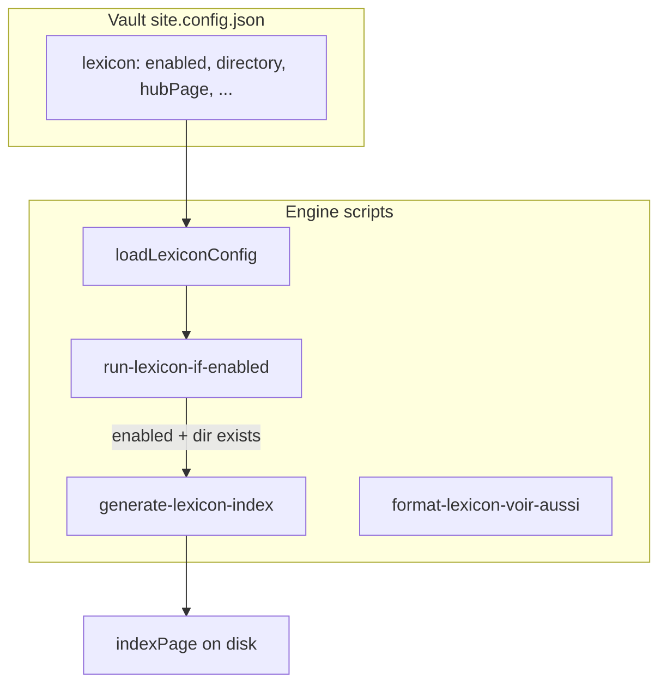

# Lexique configurable multi-vault

**Prérequis pour** : [Rétroliens phases 1–5](2026_06_01_14-00_main_link-graph-backlinks-phases-1-5.plan.md) — livrer ce plan **avant** les phases 2 et 4 du plan rétroliens (exclusions hubs et `entryTag`).

**Consommé par** : plan rétroliens (phases 2, 4, hooks prebuild).

## Objectif

L'engine reste **générique** : la logique (scan, index, format « Voir aussi ») vit dans [starlight-obsidian-engine](https://github.com/DamienBecherini/starlight-obsidian-engine). Chaque vault déclare **si** et **comment** il utilise le lexique via `site.config.json` (ex. [`ia-on-prem-vault`](https://github.com/DamienBecherini/ia-on-prem-vault)). Le README engine documente le mécanisme ; le vault ZTH documente l'instance concrète (`00-lexique`, `glossaire-ia`).



## Ordre d'exécution globale

1. Plan lexicon (ce document) — `config/lexicon.mjs` + gate predev
2. Plan rétroliens phase 1 — link-graph lib (peut chevaucher la fin du plan lexicon)
3. Plan rétroliens phases 2–5 — utilise `loadLexiconConfig()`

## État actuel (à corriger)

- Constantes figées dans [`scripts/lib/lexicon-index.mjs`](../../scripts/lib/lexicon-index.mjs) : `00-lexique`, `glossaire-ia.md`, `index-lexique.md`, tag `lexique`, textes FR en dur.
- [`package.json`](../../package.json) : `predev` / `prebuild` appellent toujours `generate-lexicon-index.mjs` → **échec** si pas de dossier lexique ([`collectLexiconEntries`](../../scripts/lib/lexicon-index.mjs) throw).
- [`config/site.mjs`](../../config/site.mjs) : ne lit pas de clé `lexicon` (seulement title, url, locales, sidebar, social).
- README engine : section couplée à `glossaire-ia` / `index-lexique` (lignes 87–93).

## Contrat `site.config.json`

Ajouter un bloc optionnel `lexicon` (documenté dans le README engine) :

| Champ | Rôle | Défaut si `enabled: true` |
|-------|------|---------------------------|
| `enabled` | Active scan + génération | `false` si bloc absent |
| `directory` | Dossier vault des fiches | **requis** quand enabled |
| `entryTag` | Tag frontmatter des entrées | `lexique` |
| `hubPage` | Fichier hub curaté (exclu du scan) | **requis** quand enabled |
| `indexPage` | Fichier index généré | **requis** quand enabled |
| `sortLocale` | Tri des titres (`localeCompare`) | `fr` |
| `index.title` | Frontmatter titre de l'index | requis |
| `index.description` | Frontmatter description | requis |
| `index.intro` | Paragraphe sous le frontmatter (markdown libre) | requis |
| `index.hubLink` | `{ "path": "glossaire-ia", "label": "Glossaire IA" }` — chemin wiki **sans** extension, relatif au vault (l'engine préfixe `directory/` pour le lien `[[...]]` si besoin) | optionnel |

**Règles de comportement**

- Bloc absent ou `enabled: false` → skip (exit 0, log info) pour le hook build/dev.
- `enabled: true` + dossier manquant → skip avec warning (ne pas bloquer `npm run dev` sur un vault sans lexique physique).
- `npm run lexicon:index` (explicite) → erreur claire si config invalide ou dossier absent (comportement strict).
- Pas de fallback silencieux vers les noms ZTH (`glossaire-ia`) dans l'engine : migration explicite dans le vault ZTH.

**Exemple ZTH** (à ajouter dans `site.config.json` du vault [`ia-on-prem-vault`](https://github.com/DamienBecherini/ia-on-prem-vault)) — équivalent des constantes actuelles :

```jsonc
"lexicon": {
  "enabled": true,
  "directory": "00-lexique",
  "entryTag": "lexique",
  "hubPage": "glossaire-ia.md",
  "indexPage": "index-lexique.md",
  "sortLocale": "fr",
  "index": {
    "title": "Index du lexique",
    "description": "Liste alphabétique de toutes les fiches du lexique IA on-premise.",
    "intro": "Liste générée automatiquement au build. Pour une lecture guidée, voir [[00-lexique/glossaire-ia|Glossaire IA]].",
    "hubLink": { "path": "glossaire-ia", "label": "Glossaire IA" }
  }
}
```

La sidebar « Glossaire IA » / « Index du lexique » **reste inchangée** dans `site.config.json` (déjà vault-owned) — pas de génération automatique de sidebar par l'engine.

## Implémentation engine

### 1. Module de config — `config/lexicon.mjs` (nouveau)

- `loadLexiconConfig(vaultRoot?)` : lit `site.config.json` via `resolveVaultPath()` (même pattern que [`config/site.mjs`](../../config/site.mjs)).
- `isLexiconEnabled(config)` / `resolveLexiconPaths(config, vaultRoot)` : chemins absolus directory, hub, index.
- Validation minimale : si `enabled`, champs requis présents ; messages d'erreur actionnables.
- Exporter un typedef JSDoc `LexiconConfig` pour les scripts.

Ne pas étendre le retour de `loadSiteConfig()` pour Starlight (évite de mélanger config Astro et tooling CLI).

### 2. Refactor [`scripts/lib/lexicon-index.mjs`](../../scripts/lib/lexicon-index.mjs)

- Remplacer les exports de constantes globales par un objet **`LexiconConfig`** passé en argument :
  - `collectLexiconEntries(vaultRoot, config)`
  - `renderIndexMarkdown(entries, config)` — liens `/{directory}/{slug}/`, intro/titre/description depuis `config.index`
  - `buildLexiconIndex` / `writeLexiconIndex(vaultRoot, config)`
- Conserver `parseLexiconFrontmatter`, `escapeTableCell`, `readLexiconEntry` (génériques).
- Supprimer les références hardcodées à `00-lexique` / `glossaire-ia` dans le markdown généré.

### 3. Scripts CLI

| Fichier | Changement |
|---------|------------|
| [`scripts/generate-lexicon-index.mjs`](../../scripts/generate-lexicon-index.mjs) | Charge config ; si disabled → message + exit 0 ; si enabled → `writeLexiconIndex` |
| [`scripts/format-lexicon-voir-aussi.mjs`](../../scripts/format-lexicon-voir-aussi.mjs) | Même gate ; répertoire / pages skip → depuis config |
| **`scripts/run-lexicon-if-enabled.mjs`** (nouveau) | Appelé par `predev` / `prebuild` : enabled + dir OK → spawn index ; sinon log et exit 0 |

[`package.json`](../../package.json) :

```json
"predev": "node scripts/ensure-vault.mjs && node scripts/run-lexicon-if-enabled.mjs",
"prebuild": "node scripts/ensure-vault.mjs && node scripts/run-lexicon-if-enabled.mjs"
```

[`scripts/lib/wiki-link-label.mjs`](../../scripts/lib/wiki-link-label.mjs) : inchangé (parcours tout le vault ; `readLexiconEntry` reste valide).

### 4. Tests — [`tests/lexicon-index.test.mjs`](../../tests/lexicon-index.test.mjs)

- Ajouter `tests/lexicon-config.test.mjs` : disabled par défaut, validation enabled, chemins résolus.
- Adapter les tests existants : passer un objet config mock (directory `00-lexique` ou `glossary` custom).
- [`tests/fixtures/minimal-vault/site.config.json`](../../tests/fixtures/minimal-vault/site.config.json) : pas de bloc `lexicon` (ou `"enabled": false`) — garantit que `npm run dev` ne casse pas.
- Optionnel : mini fixture `tests/fixtures/lexicon-vault/` (2 entrées + config) pour un test d'intégration `writeLexiconIndex` avec `directory: "glossary"`.

Vérifier que `npm test` et [`npm run test:build`](../../tests/smoke-build.mjs) passent (smoke build n'utilise pas `prebuild` — déjà OK).

### 5. Documentation

**Engine — [`README.md`](../../README.md)**

- Remplacer la section « Lexicon index (`index-lexique.md`) » par **« Optional lexicon (vault `site.config.json`) »** :
  - schéma du bloc `lexicon` ;
  - convention entrée (`title`, `description`, `entryTag`) ;
  - hub vs index généré ;
  - commandes `lexicon:index` / `lexicon:voir-aussi` ;
  - exemple générique (`glossary/`, pas `glossaire-ia`).
- Table des scripts : préciser que `predev`/`prebuild` n'exécutent l'index que si `lexicon.enabled`.

**Vault ZTH — README du repo [`ia-on-prem-vault`](https://github.com/DamienBecherini/ia-on-prem-vault)**

- Ajouter `00-lexique/` dans « Vault layout ».
- Courte section « Lexicon » : hub `glossaire-ia.md`, index généré, template `_templates/_Terme Lexique.md`, commande `npm run lexicon:index` depuis l'engine, politique de commit de `index-lexique.md` (conserver l'actuelle : committer avec le vault quand les fiches changent).

**Optionnel vault** : `npm run lexicon:index` via `scripts/delegate.mjs` du vault — hors scope minimal ; mentionner dans la doc vault sans l'implémenter si non demandé.

### 6. Vault ZTH — migration contenu

- Ajouter le bloc `lexicon` dans `site.config.json` du vault ZTH.
- Lancer une fois `npm run lexicon:index` (engine) pour régénérer `00-lexique/index-lexique.md` avec la nouvelle intro (doit rester équivalente si config correcte).
- Aucune modification obligatoire des fiches lexique ni de `glossaire-ia.md` (chemins wiki inchangés).

### 7. Hors scope (noter seulement)

- Doublons git `00-lexique/foo.md` vs `00-lexique\foo.md` sur Windows : nettoyage manuel séparé dans le vault.
- Publication du plan dans `AIContextCraft/docs/plans/` : non applicable (workspace engine/vault).

## Ordre d'exécution recommandé (ce plan)

1. `config/lexicon.mjs` + tests config
2. Refactor `lexicon-index.mjs` + mise à jour tests lexicon
3. `run-lexicon-if-enabled.mjs` + `package.json` hooks
4. Adapter `generate-lexicon-index.mjs` / `format-lexicon-voir-aussi.mjs`
5. `site.config.json` ZTH + regen index
6. README engine + README vault
7. `npm test` + `npm run test:build` + smoke manuel `npm run dev` avec vault ZTH et minimal fixture

## Critères d'acceptation

- Vault **sans** `lexicon.enabled` : `npm run dev` / `npm run build` OK, pas d'écriture lexique.
- Vault ZTH avec bloc `lexicon` : index régénéré, liens `/00-lexique/.../` identiques au comportement actuel.
- Vault hypothétique avec `directory: "glossary"` : index écrit dans `glossary/{indexPage}` sans code engine spécifique ZTH.
- README engine ne cite plus `glossaire-ia` comme convention globale.
- Aucune constante `GLOSSARY_BASENAME` / `LEXICON_DIR` exportée comme API publique du moteur (remplacées par config).

---

## Rapport d'implémentation

**Date** : 2026-06-02  
**Statut** : livré

### Modifications

| Zone | Fichiers |
|------|----------|
| Config | [`config/lexicon.mjs`](../../config/lexicon.mjs) (nouveau) |
| Scripts | [`scripts/run-lexicon-if-enabled.mjs`](../../scripts/run-lexicon-if-enabled.mjs), refactor [`scripts/lib/lexicon-index.mjs`](../../scripts/lib/lexicon-index.mjs), [`scripts/generate-lexicon-index.mjs`](../../scripts/generate-lexicon-index.mjs), [`scripts/format-lexicon-voir-aussi.mjs`](../../scripts/format-lexicon-voir-aussi.mjs) |
| Vault ZTH | [`ia-on-prem-vault/site.config.json`](https://github.com/DamienBecherini/ia-on-prem-vault) — bloc `lexicon` |
| Docs | [`README.md`](../../README.md) (section Optional lexicon), README vault ZTH |
| Tests | [`tests/lexicon-config.test.mjs`](../../tests/lexicon-config.test.mjs), [`tests/lexicon-index.test.mjs`](../../tests/lexicon-index.test.mjs) mis à jour |
| Hooks | [`package.json`](../../package.json) — `predev` / `prebuild` → `run-lexicon-if-enabled` |

### Validation

- `npm test` : **63** tests, 0 échec.
- `npm run test:build` : smoke build OK (minimal-vault sans lexique).
- `npm run lexicon:index` sur vault ZTH : **26** entrées → `00-lexique/index-lexique.md`.
- `run-lexicon-if-enabled` sur minimal-vault : skip avec message info, exit 0.

### Suite

Plan rétroliens phases 1–5 : [`2026_06_01_14-00_main_link-graph-backlinks-phases-1-5.plan.md`](2026_06_01_14-00_main_link-graph-backlinks-phases-1-5.plan.md) — **livré le 2026-06-02** (rapport en fin de ce plan ; consomme `loadLexiconConfig` / `getLexiconExcludeSlugs`).
